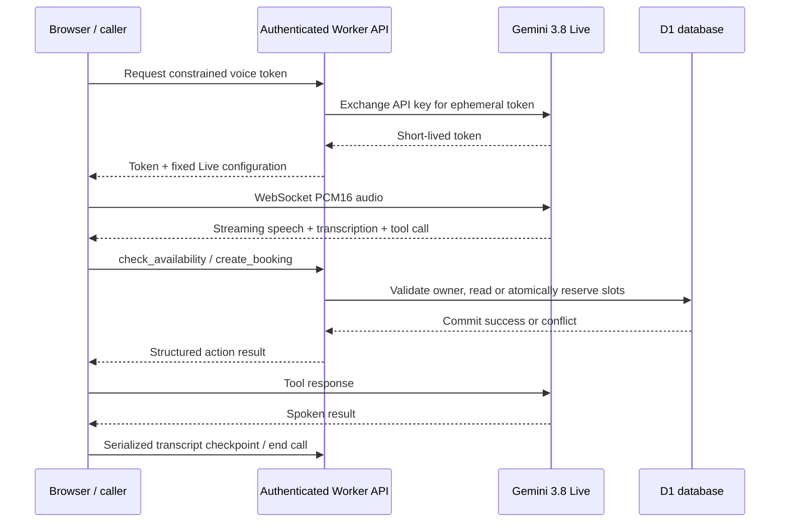

# Architecture and decisions

## Booking invariant

For any `(owner, staff, date, 15-minute interval)`, at most one active appointment can hold that interval. The `occupied_slots` composite primary key enforces this. A haircut at 14:00 occupies 14:00, 14:15 and 14:30. A second request at 14:30 conflicts even if both callers saw availability before either committed.

One D1 `batch` inserts the appointment and all occupied intervals atomically. A unique conflict rolls the entire batch back. Ordinary inserts are intentional: ignoring a conflict could create an appointment without all its reservations. Availability is advisory; the database is the final authority.

`(owner, request_id)` uniquely identifies a booking request. The canonical payload is stored so a retry can return the original booking only when the details match. A retry after cancellation returns the cancelled original and does not recreate it. Browser voice tool IDs are scoped to their persisted call ID. A separate status tool resolves uncertain commit outcomes after a lost response.

## Voice lifecycle

Audio remains browser-to-Gemini to avoid a second WebSocket relay. The Worker handles business operations and exchanges a long-lived API key for a single-use ephemeral token with a 60-second connection window and 15-minute expiry. The 12-minute app call limit fits inside that token's life. Google controls resumability; resumption is best-effort and a failure tells the user to start another call.

Each connection captures a generation number so old socket callbacks cannot terminate a replacement. HTTP tool results remain queued during reconnect and are sent only when a live session exists. Interrupted tools stop delivery; cancelling delivery does not undo a transaction that already committed. Users can inspect the calendar and the model can query the action's status.

An output generation prevents audio waiting on `AudioContext.resume()` from playing after the caller interrupts. Transcript checkpoints run serially; the server only accepts transcript updates while a call is active. A terminal record cannot return to active or lose its final transcript. Outcomes are set by server actions, independent of client transcript snapshots. A follow-up note has priority because it requires the owner's attention.

## Trust boundaries

The model proposes actions. The API independently checks authentication, owner scope, service/staff membership, calendar validity, office hours, future time, 15-minute alignment, explicit confirmation flag, contact fields, idempotency and occupancy. It exposes only a small tool allowlist. The model cannot execute SQL or choose an owner identifier.

The confirmation flag is validated by the server but the fact that a caller gave spoken consent is model-interpreted. The application does not claim a cryptographic or independently verified voice-consent guarantee. The prompt requires a readback followed by explicit confirmation. Manual evaluation must test corrections and ambiguous assent before customer use.

Browser-provided transcripts are owner-visible records, not tamper-proof audit evidence. No raw audio is retained. The browser key field remains in React memory and is exchanged by the server; the browser receives only the short-lived credential. Production and development both use Better Auth with D1-backed sessions. Incoming Sites identity headers are ignored. Owner scope derives from a validated session user ID; email is unverified and is never used to link accounts or import previous workspaces.

## Deliberate limits and next steps

Each signed-in visitor owns an isolated salon workspace. Shared-key admission uses database check constraints and atomic D1 batches for user/global quotas; permits count until provider-token expiry even when calls end or transcripts are deleted. Booking tools require issued, unexpired sessions with a recent heartbeat. Reconciliation marks abandoned calls interrupted. History uses cursor pagination, and transcript deletion removes text and follow-up content while preserving permit metadata.

The production scope remains browser voice. Telephony, SMS/email, payments, multi-location scheduling and calendar synchronization are not implemented. Services, two staff members, operating hours and IST are fixed in `lib/domain.ts`. Real voice booking correctness and reconnection across forced network failure require manual evaluation; no accuracy or latency SLA is claimed. The dashboard currently displays the next 100 appointments.

## References

- [Gemini Live ephemeral tokens](https://ai.google.dev/gemini-api/docs/live-api/ephemeral-tokens)
- [Gemini Live capabilities and audio formats](https://ai.google.dev/gemini-api/docs/live-api/capabilities)
- [Cloudflare D1 batch API](https://developers.cloudflare.com/d1/worker-api/d1-database/#batch)
